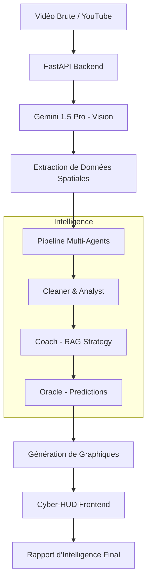

# AURORA // Système d'Intelligence Tactique Hybride

AURORA est une plateforme de **Decision Intelligence** de pointe pour Valorant. Elle transforme des flux vidéo bruts en analyses tactiques de niveau professionnel en combinant la vision par ordinateur et un système multi-agents sophistiqué.

## 📝 Description Générale

Le projet AURORA repose sur trois piliers fondamentaux :
*   **Analyse Vidéo Multimodale** : Utilisation de **Gemini 1.5 Pro** pour interpréter les visuels de jeu (VOD, flux en direct).
*   **Intelligence Multi-Agents** : Un pipeline de 5 agents spécialisés qui collaborent pour auditer, conseiller et prédire.
*   **Visualisation Tactique Haute Fidélité** : Génération automatisée de heatmaps, de tracés de mouvements et de tableaux de bord (Cyber-HUD).

## 🗂️ Catégorisation des Fichiers Clés

Les fichiers sont organisés pour supporter un flux allant de la capture de données à la présentation visuelle.

### ⚙️ Cœur du Système (Backend & Orchestration)
*   **`aurora_backend.py`** : Le serveur principal (FastAPI) qui orchestre les requêtes d'analyse et coordonne les agents.
*   **`valorant_tactical_engine.py`** : Le moteur logique contenant la base de connaissances sur les cartes, les agents et les tactiques professionnelles.
*   **`gemini_vision_client.py`** : L'interface avec l'API Gemini 1.5 Pro pour l'analyse visuelle des frames.

### 🤖 Intelligence Multi-Agents
*   **`aurora_agents.py`** : Contient les agents de base comme `CleanerBot` (nettoyage de données) et `AnalystBot` (calcul des KPIs).
*   **`aurora_advanced_agents.py`** : Implémente `CoachBot` (recommandations RAG) et `OracleBot` (prédictions de victoire et risques).
*   **`aurora_rag_system.py`** : Système de *Retrieval-Augmented Generation* utilisant FAISS pour rechercher des stratégies VCT réelles.

### 🌐 Interface & Visualisation
*   **`index.html`** / **`aurora_tactical_frontend.js`** : Le Cyber-HUD, une interface futuriste en "glass-morphism" pour l'utilisateur final.
*   **`generate_high_fidelity_mocks.py`** : Utilitaire de génération de graphiques tactiques (heatmaps, trajectoires).

### 🔄 Automatisation & Intégration
*   **`n8n_integration.py`** : Module permettant de connecter AURORA à des outils d'automatisation externes (Discord, YouTube).
*   **`n8n_workflows/`** : Templates de workflows pour le traitement automatisé de chaînes YouTube.

---

## 🔄 Workflow Global du Système

Le fonctionnement d'AURORA suit un cycle logique précis pour transformer le pixel en décision :

1.  **Ingestion Tactique** :
    *   L'utilisateur soumet une vidéo ou un lien YouTube via le **Cyber-HUD**.
    *   Le backend extrait les frames clés via le `VideoAnalyzer`.

2.  **Analyse Visuelle (Vision Layer)** :
    *   **Gemini Vision** identifie la carte, les agents présents et les événements marquants (kills, poses de spike).
    *   Le système synchronise ces données avec les coordonnées réelles des cartes.

3.  **Pipeline Multi-Agents (Intelligence Layer)** :
    *   **CleanerBot** : Valide et structure les données extraites.
    *   **AnalystBot** : Calcule le score OVR (*Overall Valorant Rating*) et l'efficacité tactique.
    *   **CoachBot** : Interroge le système **RAG** pour proposer des stratégies de pro-teams (Fnatic, Sentinels, etc.).
    *   **OracleBot** : Évalue les risques et prédit les probabilités de succès du round.

4.  **Projection de l'Intelligence (Output)** :
    *   Le système génère des **Heatmaps** et des **Blueprints** dynamiques.
    *   Le rapport final est envoyé au frontend et, si configuré, via des notifications (Discord/n8n).

---

## 📊 Architecture du Flux de Données

> [!TIP]
> **Le système RAG** est la pièce maîtresse pour le coaching : il ne se contente pas d'analyser vos erreurs, il compare vos mouvements à une base de données de plus de 8 stratégies VCT professionnelles pour vous dire exactement quoi corriger.
