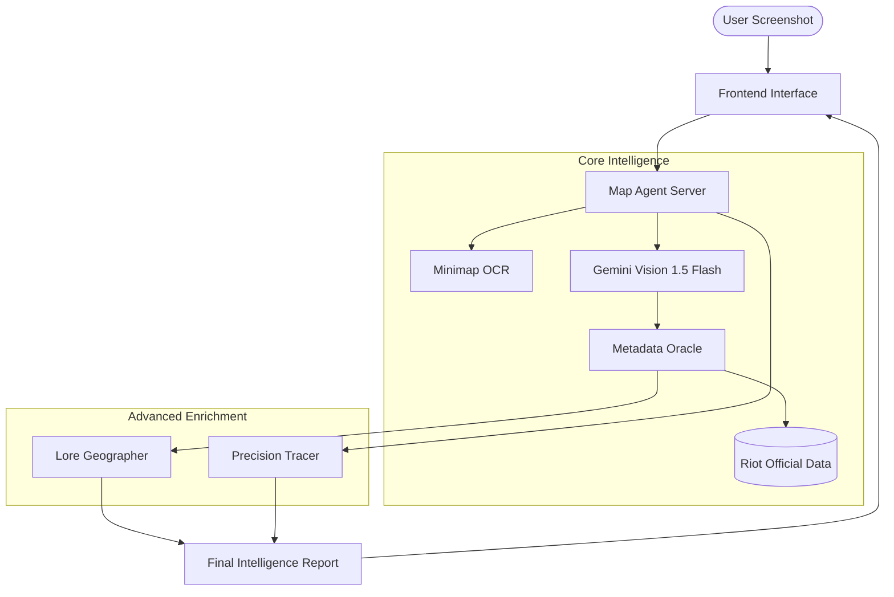

# 🗺️ AURORA // MAP AGENT WORKFLOW

> The **Map Agent** is a specialized spatial intelligence module within the AURORA tactical ecosystem. It leverages Multi-Modal LLMs (Gemini Vision) and official Riot Games metadata to provide real-time geographic and tactical awareness from gameplay visuals.

---

## 🌟 General Description & Purpose

The Map Agent's primary role is to bridge the gap between **pure visual data** (screenshots/streams) and **structured tactical intelligence**. 

Instead of relying on complex computer vision models for every map variant, it uses a hybrid approach:
1. **Visual Recognition**: Using Gemini Vision to "see" the map and callout.
2. **Data Grounding**: Validating visual detections against official Riot Games API data.
3. **Lore Synthesis**: Enriching tactical data with real-world geographical context and narrative "flavor".

**Key Objectives:**
- Automate map and location detection from raw pixels.
- Provide precise world coordinates for tactical mapping.
- Deliver context-rich briefings (Tactical Advice + Lore) to the user.

---

## ⚙️ How It Works: System Architecture

The workflow follows a linear pipeline from **Ingestion** to **Enrichment**.

---

## 🧩 Component Analysis

### 1. 🖥️ Map Agent Server (`map_agent_server.py`)
The central orchestrator of the entire workflow. It manages the lifecycle of an analysis request.
- **Input**: Raw Image Byte-stream (PNG/JPG).
- **Process**: 
    - Performs pre-analysis OCR.
    - Synchronizes calls between Gemini Vision, the Oracle, and the Lore Agent.
    - Executes "Precision Tracing" using PIL/Numpy.
- **Output**: Unified JSON Tactical Intelligence Object.

### 2. 🔮 Metadata Oracle (`metadata_oracle.py`)
The authoritative source of truth that converts natural language into spatial data.
- **Input**: Predicted Map Name and Location String (e.g., "Split", "A Ramps").
- **Process**: 
    - Fuzzy matches detections against the official Riot Game Data.
    - Calculates elevation levels (e.g., "Heaven vs Ground").
    - Provides coordinate scalars for pixel-to-world conversion.
- **Output**: Official coordinates (X, Y, Z), Super-region (Zone), and specific Tactical Advice.

### 3. 🌍 Lore Geographer (`lore_geographer.py`)
Adds a layer of narrative and real-world context to the tactical data.
- **Input**: Lore Coordinates (Lat/Long extracted from the Oracle).
- **Process**: 
    - Matches coordinates to real-world cities and countries.
    - Generates localized briefing snippets using Gemini's creative capabilities.
- **Output**: Real-world location name and "Tactical Lore Report".

### 4. 🛰️ Riot Scraper (`riot_scraper.py`)
An offline utility that keeps the system's "brain" updated with the latest map changes.
- **Input**: Valorant-API.com endpoints.
- **Process**: 
    - Downloads assets (minimaps, splashes).
    - Serializes callout metadata and coordinate scalars into a localized index.
- **Output**: `riot_official_data/index.json` knowledge base.

### 5. 🎨 Spatial Frontend (`index.html`)
A high-fidelity dashboard for user interaction.
- **Input**: User drag-and-drop actions.
- **Process**: 
    - Renders real-time previews.
    - Communicates with the FastAPI backend.
    - Displays beautified intelligence streams using glassmorphic UI elements.
- **Output**: Visual representation of the detected map, coordinates, and tactical context.

---

## 📊 Summary of Data Flow

| Component | Input | Primary Tool | Output |
| :--- | :--- | :--- | :--- |
| **Server** | Screenshot | FastAPI / Gemini | Raw Map ID |
| **Oracle** | Raw Map ID | Fuzzy Matching | Exact Coordinates |
| **Geographer** | Lore Coords | Gemini NLP | Geo-Context |
| **Tracer** | Minimap Pixel | Matrix Math | World-Space Coords |

> [!TIP]
> **Precision Tracing** is the most advanced feature; it finds the white "Player Icon" on the minimap and uses Riot's official multipliers to determine where the player is standing in the 3D world with high accuracy.
